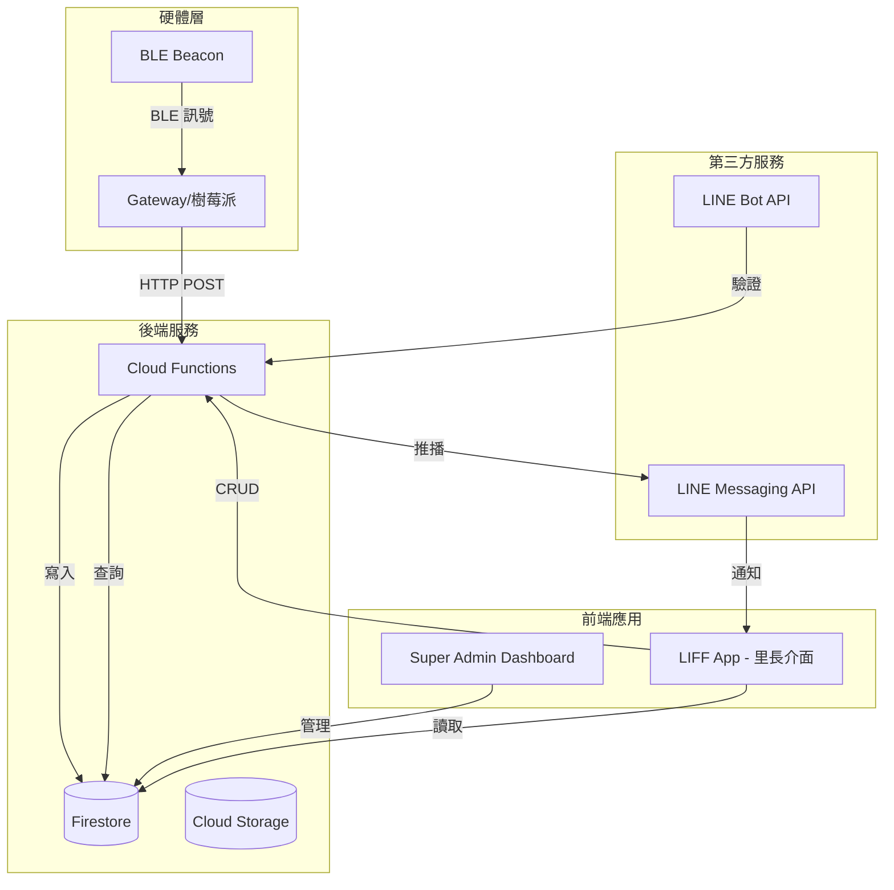
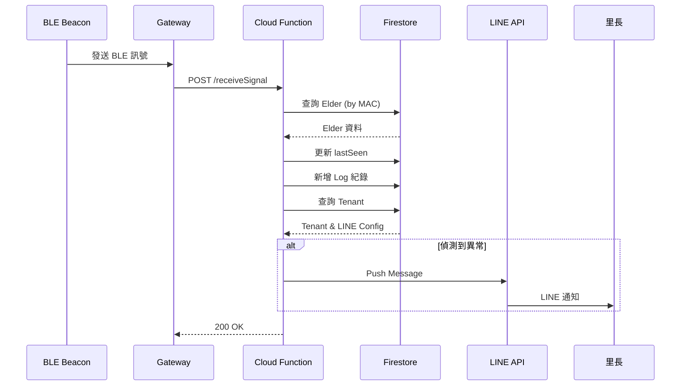

# Community Guardian SaaS - 產品需求文件 (PRD)

**版本：** 1.0  
**日期：** 2026-01-14  
**撰寫者：** 產品經理  
**目標受眾：** 工程團隊、產品團隊

---

## 目錄

1. [產品概述](#1-產品概述)
2. [使用者故事](#2-使用者故事)
3. [系統架構](#3-系統架構)
4. [資料庫結構](#4-資料庫結構)
5. [API 規格](#5-api-規格)
6. [功能需求](#6-功能需求)
7. [硬體模擬器規格](#7-硬體模擬器規格)
8. [技術堆疊](#8-技術堆疊)
9. [安全性考量](#9-安全性考量)
10. [未來規劃](#10-未來規劃)

---

## 1. 產品概述

### 1.1 產品定位

**Community Guardian SaaS** 是一個 B2B2C 物聯網監控平台，旨在協助社區/里長監控獨居長者的安全狀態。透過 BLE Beacon 與 Gateway 的整合，系統能即時追蹤長者活動，並在偵測到異常時立即通知管理員。

### 1.2 核心價值

- **零下載門檻：** 透過 LINE 官方帳號與 LIFF 技術，使用者無需下載額外 App。
- **即時監控：** 24/7 持續監控長者狀態，提供即時警報。
- **多租戶架構：** 支援多個社區獨立管理，資料隔離安全。
- **易於部署：** 快速為新社區建立服務，最短 5 分鐘內完成設定。

### 1.3 商業模式

```
平台方 (Super Admin)
    ↓ 提供 SaaS 服務
社區/里長 (Tenant Admin)
    ↓ 服務管理
獨居長者 (End User)
```

- **收費模式：** 按社區訂閱制 (月費/年費)
- **計價單位：** 依長者人數或裝置數量分級收費

### 1.4 目標用戶

1. **Super Admin (平台方):**

   - 角色：系統管理員、技術支援人員
   - 目標：管理多個社區、監控系統健康度、提供技術支援

2. **Tenant Admin (里長/社區管理員):**

   - 角色：社區負責人、里長、志工團隊
   - 目標：監控長者安全、快速回應異常、管理長者資料

3. **End User (獨居長者):**
   - 角色：配戴 Beacon 裝置的長者
   - 需求：無感監控、緊急求救功能

---

## 2. 使用者故事

### 2.1 Super Admin (平台管理方)

#### US-SA-001: 建立新社區

```gherkin
作為 Super Admin
我想要 在後台快速建立新的 Tenant (社區)
以便 快速為新客戶開通服務

驗收標準：
- [ ] 可輸入社區名稱、地址、聯絡人資訊
- [ ] 系統自動生成唯一 Tenant ID
- [ ] 建立成功後顯示確認訊息
```

#### US-SA-002: 設定 LINE 整合

```gherkin
作為 Super Admin
我想要 為特定 Tenant 設定 LINE Channel Token 與 LIFF ID
以便 該社區的 LINE 功能能正常運作

驗收標準：
- [ ] 可輸入 Channel Access Token
- [ ] 可輸入 Channel Secret
- [ ] 可輸入 LIFF ID
- [ ] 系統驗證 Token 有效性
- [ ] 設定儲存後立即生效
```

#### US-SA-003: 硬體模擬測試

```gherkin
作為 Super Admin
我想要 使用內建的「硬體模擬器」發送模擬訊號
以便 驗證系統的警報與紀錄邏輯是否正常運作

驗收標準：
- [ ] 可選擇目標 Tenant 和 Elder
- [ ] 可自訂訊號類型 (緊急/一般/健康/其他)
- [ ] 發送後可在 Firestore 查看紀錄
- [ ] 緊急訊號會觸發 LINE 推播
- [ ] 介面顯示發送結果（成功/失敗）
```

#### US-SA-004: 管理授權管理員

```gherkin
作為 Super Admin
我想要 為每個 Tenant 新增或移除授權的 LINE User ID
以便 控制哪些里長可以存取該社區的管理介面

驗收標準：
- [ ] 可查看目前授權的 LINE ID 列表
- [ ] 可新增 LINE User ID
- [ ] 可移除已授權的 ID
- [ ] 變更立即生效
```

### 2.2 Tenant Admin (里長/社區管理員)

#### US-TA-001: 自動化 Onboarding

```gherkin
作為 里長
我想要 加入 LINE 官方帳號後點擊 LIFF 連結，系統自動辨識我的身分
以便 無需複雜註冊流程即可開始使用

驗收標準：
- [ ] 點擊 LIFF 連結後自動取得 LINE User ID
- [ ] 系統比對 User ID 與 Tenant 的 adminLineIds
- [ ] 授權用戶直接進入管理介面
- [ ] 未授權用戶顯示「權限不足」提示
```

#### US-TA-002: 長者資料建檔

```gherkin
作為 里長
我想要 在 LIFF 頁面輸入長者姓名並綁定 Beacon MAC Address
以便 系統能追蹤該長者的活動狀態

驗收標準：
- [ ] 表單包含姓名、年齡、地址、緊急聯絡人等欄位
- [ ] 必須輸入 Beacon MAC Address (格式驗證)
- [ ] 可選擇手動輸入或掃描 QR Code
- [ ] 儲存成功後顯示在長者列表
- [ ] 防止重複綁定相同 MAC Address
```

#### US-TA-003: 即時狀態監控

```gherkin
作為 里長
我想要 在 LIFF 頁面查看所有長者的清單及其最後出現時間
以便 快速掌握長者的安全狀態

驗收標準：
- [ ] 列表顯示所有長者姓名、年齡、最後出現時間
- [ ] 超過 12 小時未更新的長者標示警告
- [ ] 可點擊查看單一長者的歷史紀錄
- [ ] 支援下拉重新整理
- [ ] 顯示長者當前狀態 (正常/警告/異常)
```

#### US-TA-004: 異常警報接收

```gherkin
作為 里長
我想要 當系統偵測到異常時即時收到 LINE 推播通知
以便 能快速回應並採取行動

驗收標準：
- [ ] 緊急按鈕觸發時立即推播
- [ ] 長時間未偵測到訊號時推播
- [ ] 推播訊息包含長者姓名、異常類型、時間
- [ ] 訊息包含快速連結至 LIFF 詳細資訊頁
- [ ] 推播記錄可在系統中查詢
```

#### US-TA-005: 歷史紀錄查詢

```gherkin
作為 里長
我想要 查看特定長者的活動歷史紀錄
以便 分析長者的生活模式與異常事件

驗收標準：
- [ ] 可選擇日期範圍
- [ ] 顯示時間軸格式的活動紀錄
- [ ] 包含訊號強度 (RSSI)、Gateway ID
- [ ] 可匯出 CSV 格式報表
```

---

## 3. 系統架構

### 3.1 整體架構圖



### 3.2 資料流程圖



### 3.3 技術棧選型理由

| 層級     | 技術                     | 選型理由                                    |
| -------- | ------------------------ | ------------------------------------------- |
| 前端框架 | React + TypeScript       | 型別安全、生態系完整                        |
| 狀態管理 | Zustand                  | 輕量、易用、效能佳                          |
| 樣式     | Tailwind CSS             | 快速開發、一致性高                          |
| 後端     | Firebase Cloud Functions | Serverless、自動擴展、與 Firestore 整合度高 |
| 資料庫   | Firestore                | NoSQL、即時同步、離線支援                   |
| 身分驗證 | LINE Login (LIFF)        | 符合台灣用戶習慣、零下載門檻                |
| 推播通知 | LINE Messaging API       | 開信率高、使用者熟悉                        |

---

## 4. 資料庫結構

### 4.1 Collection: `tenants`

**用途：** 儲存社區（客戶）的基本資訊與 LINE 設定。

```typescript
interface Tenant {
  id: string; // Firestore Document ID
  name: string; // 社區名稱
  address?: string; // 社區地址
  contactPerson?: string; // 聯絡人姓名
  contactPhone?: string; // 聯絡電話
  lineConfig: {
    channelAccessToken: string; // LINE Channel Access Token
    channelSecret: string; // LINE Channel Secret
    liffId: string; // LIFF App ID
  };
  adminLineIds: string[]; // 授權管理員的 LINE User ID 陣列
  subscription: {
    plan: "basic" | "pro" | "enterprise";
    startDate: string; // ISO 8601 格式
    endDate: string;
    status: "active" | "suspended" | "expired";
  };
  settings: {
    alertThresholdHours: number; // 超過 N 小時未偵測則警報（預設 12）
    enableEmergencyAlert: boolean;
    enableInactivityAlert: boolean;
  };
  createdAt: string; // ISO 8601
  updatedAt: string;
}
```

**範例資料：**

```json
{
  "id": "tenant-001",
  "name": "幸福社區",
  "address": "台北市大安區復興南路一段 123 號",
  "contactPerson": "王里長",
  "contactPhone": "0912-345-678",
  "lineConfig": {
    "channelAccessToken": "xxxxxxxxxxxxxxxxxxxxxxxxxxx",
    "channelSecret": "yyyyyyyyyyyyyyyyy",
    "liffId": "1234567890-abcdefgh"
  },
  "adminLineIds": [
    "U1234567890abcdef1234567890abcdef",
    "U9876543210fedcba0987654321fedcba"
  ],
  "subscription": {
    "plan": "pro",
    "startDate": "2026-01-01T00:00:00Z",
    "endDate": "2026-12-31T23:59:59Z",
    "status": "active"
  },
  "settings": {
    "alertThresholdHours": 12,
    "enableEmergencyAlert": true,
    "enableInactivityAlert": true
  },
  "createdAt": "2026-01-01T10:00:00Z",
  "updatedAt": "2026-01-14T15:30:00Z"
}
```

**索引需求：**

- `adminLineIds` (Array-contains)

---

### 4.2 Collection: `elders`

**用途：** 儲存長者的基本資料與監控狀態。

```typescript
interface Elder {
  id: string; // Firestore Document ID
  tenantId: string; // 所屬社區 (Foreign Key)
  name: string; // 長者姓名
  age?: number; // 年齡
  gender?: "male" | "female" | "other";
  address?: string; // 居住地址
  contactPhone?: string; // 本人電話
  emergencyContact?: string; // 緊急聯絡人姓名
  emergencyPhone?: string; // 緊急聯絡人電話
  macAddress: string; // Beacon MAC Address (唯一)
  status: "active" | "inactive" | "offline";
  lastSeen: string; // 最後偵測時間 ISO 8601
  lastSignalRssi?: number; // 最後訊號強度
  lastGatewayId?: string; // 最後偵測的 Gateway
  notes?: string; // 備註
  createdAt: string;
  updatedAt: string;
}
```

**範例資料：**

```json
{
  "id": "elder-001",
  "tenantId": "tenant-001",
  "name": "王大明",
  "age": 78,
  "gender": "male",
  "address": "台北市大安區建國南路二段 50 號 3 樓",
  "contactPhone": "0912-111-222",
  "emergencyContact": "王小華 (兒子)",
  "emergencyPhone": "0912-333-444",
  "macAddress": "AA:BB:CC:DD:EE:FF",
  "status": "active",
  "lastSeen": "2026-01-14T10:05:00Z",
  "lastSignalRssi": -65,
  "lastGatewayId": "GW-001",
  "notes": "有高血壓病史，每日需服藥",
  "createdAt": "2026-01-10T09:00:00Z",
  "updatedAt": "2026-01-14T10:05:00Z"
}
```

**索引需求：**

- `tenantId` (Ascending)
- `macAddress` (Ascending, Unique)
- Composite: `tenantId` + `status`

---

### 4.3 Collection: `logs`

**用途：** 儲存 IoT 訊號原始紀錄，用於歷史查詢與分析。

```typescript
interface SignalLog {
  id: string; // Firestore Document ID
  tenantId: string; // 所屬社區
  elderId: string; // 長者 ID (Foreign Key)
  macAddress: string; // Beacon MAC Address
  rssi: number; // 訊號強度 (dBm)
  gatewayId: string; // Gateway 設備 ID
  signalType: "normal" | "emergency" | "health" | "other";
  timestamp: string; // 訊號時間 ISO 8601
  metadata?: {
    batteryLevel?: number; // 電池電量 (%)
    temperature?: number; // 環境溫度
    humidity?: number; // 環境濕度
  };
  createdAt: string; // 寫入 Firestore 時間
}
```

**範例資料：**

```json
{
  "id": "log-20260114-001",
  "tenantId": "tenant-001",
  "elderId": "elder-001",
  "macAddress": "AA:BB:CC:DD:EE:FF",
  "rssi": -65,
  "gatewayId": "GW-001",
  "signalType": "normal",
  "timestamp": "2026-01-14T10:05:00Z",
  "metadata": {
    "batteryLevel": 85,
    "temperature": 24.5,
    "humidity": 60
  },
  "createdAt": "2026-01-14T10:05:02Z"
}
```

**索引需求：**

- `elderId` + `timestamp` (Descending)
- `tenantId` + `timestamp` (Descending)
- `macAddress` + `timestamp` (Descending)

**資料保留政策：**

- 熱資料：最近 30 天保留在 Firestore
- 冷資料：30 天以上匯出至 Cloud Storage 或 BigQuery

---

### 4.4 Collection: `alerts`

**用途：** 儲存警報事件紀錄。

```typescript
interface Alert {
  id: string;
  tenantId: string;
  elderId: string;
  elderName: string; // 冗餘儲存，避免 JOIN
  alertType: "emergency" | "inactivity" | "low_battery" | "device_offline";
  severity: "low" | "medium" | "high" | "critical";
  message: string;
  status: "pending" | "acknowledged" | "resolved";
  acknowledgedBy?: string; // LINE User ID
  acknowledgedAt?: string;
  resolvedAt?: string;
  notificationSent: boolean;
  notificationSentAt?: string;
  createdAt: string;
}
```

**範例資料：**

```json
{
  "id": "alert-001",
  "tenantId": "tenant-001",
  "elderId": "elder-001",
  "elderName": "王大明",
  "alertType": "inactivity",
  "severity": "high",
  "message": "王大明已超過 12 小時未偵測到活動訊號",
  "status": "acknowledged",
  "acknowledgedBy": "U1234567890abcdef1234567890abcdef",
  "acknowledgedAt": "2026-01-14T22:10:00Z",
  "notificationSent": true,
  "notificationSentAt": "2026-01-14T22:05:30Z",
  "createdAt": "2026-01-14T22:05:00Z"
}
```

---

## 5. API 規格

### 5.1 Cloud Function: `receiveSignal`

**端點：** `POST /receiveSignal`

**用途：** 接收 Gateway 發送的 IoT 訊號，更新長者狀態並判斷是否需要發送警報。

#### 5.1.1 請求格式

```typescript
interface ReceiveSignalRequest {
  macAddress: string; // Beacon MAC Address (必填)
  rssi: number; // 訊號強度 (必填)
  gatewayId: string; // Gateway 設備 ID (必填)
  signalType?: "normal" | "emergency" | "health" | "other"; // 預設 'normal'
  timestamp?: string; // ISO 8601，若未提供則使用伺服器時間
  metadata?: {
    batteryLevel?: number;
    temperature?: number;
    humidity?: number;
  };
}
```

**範例請求：**

```json
POST /receiveSignal
Content-Type: application/json

{
  "macAddress": "AA:BB:CC:DD:EE:FF",
  "rssi": -68,
  "gatewayId": "GW-001",
  "signalType": "normal",
  "timestamp": "2026-01-14T15:30:00Z",
  "metadata": {
    "batteryLevel": 82
  }
}
```

#### 5.1.2 回應格式

**成功回應 (200):**

```json
{
  "success": true,
  "message": "Signal processed successfully",
  "data": {
    "logId": "log-20260114-001",
    "elderName": "王大明",
    "alertTriggered": false
  }
}
```

**錯誤回應 (400 - MAC 不存在):**

```json
{
  "success": false,
  "error": "ELDER_NOT_FOUND",
  "message": "No elder found with MAC address: AA:BB:CC:DD:EE:FF"
}
```

**錯誤回應 (500 - 內部錯誤):**

```json
{
  "success": false,
  "error": "INTERNAL_ERROR",
  "message": "Failed to process signal"
}
```

#### 5.1.3 處理邏輯

```typescript
// 偽代碼
async function receiveSignal(request: ReceiveSignalRequest) {
  // Step 1: 驗證請求
  if (!request.macAddress || !request.rssi || !request.gatewayId) {
    throw new Error("Missing required fields");
  }

  // Step 2: 查詢長者資料
  const elder = await db
    .collection("elders")
    .where("macAddress", "==", request.macAddress)
    .limit(1)
    .get();

  if (elder.empty) {
    throw new Error("ELDER_NOT_FOUND");
  }

  const elderData = elder.docs[0].data();
  const elderId = elder.docs[0].id;

  // Step 3: 新增訊號紀錄
  const logRef = await db.collection("logs").add({
    tenantId: elderData.tenantId,
    elderId: elderId,
    macAddress: request.macAddress,
    rssi: request.rssi,
    gatewayId: request.gatewayId,
    signalType: request.signalType || "normal",
    timestamp: request.timestamp || new Date().toISOString(),
    metadata: request.metadata || {},
    createdAt: new Date().toISOString(),
  });

  // Step 4: 更新長者最後出現時間
  await db
    .collection("elders")
    .doc(elderId)
    .update({
      lastSeen: request.timestamp || new Date().toISOString(),
      lastSignalRssi: request.rssi,
      lastGatewayId: request.gatewayId,
      status: "active",
      updatedAt: new Date().toISOString(),
    });

  // Step 5: 檢查是否需要發送警報
  let alertTriggered = false;

  // 5.1 緊急按鈕警報
  if (request.signalType === "emergency") {
    await createAlert(elderData.tenantId, elderId, "emergency");
    await sendLineNotification(elderData.tenantId, elderId, "emergency");
    alertTriggered = true;
  }

  // 5.2 低電量警報
  if (request.metadata?.batteryLevel && request.metadata.batteryLevel < 20) {
    await createAlert(elderData.tenantId, elderId, "low_battery");
    await sendLineNotification(elderData.tenantId, elderId, "low_battery");
    alertTriggered = true;
  }

  return {
    success: true,
    message: "Signal processed successfully",
    data: {
      logId: logRef.id,
      elderName: elderData.name,
      alertTriggered,
    },
  };
}
```

#### 5.1.4 警報判斷邏輯

| 條件                         | 警報類型     | 嚴重程度 | 通知方式           |
| ---------------------------- | ------------ | -------- | ------------------ |
| `signalType === 'emergency'` | 緊急求救     | Critical | 立即推播所有管理員 |
| `lastSeen > 12小時`          | 長時間未活動 | High     | 推播 + SMS (選配)  |
| `batteryLevel < 20%`         | 電池電量不足 | Medium   | 推播               |
| `batteryLevel < 5%`          | 電池即將耗盡 | High     | 推播               |
| 裝置 24 小時無訊號           | 裝置離線     | High     | 推播               |

---

### 5.2 Cloud Function: `sendLineNotification`

**用途：** 發送 LINE 推播通知給社區管理員。

```typescript
async function sendLineNotification(
  tenantId: string,
  elderId: string,
  alertType: AlertType
) {
  // Step 1: 取得 Tenant 與 Elder 資料
  const tenant = await db.collection("tenants").doc(tenantId).get();
  const elder = await db.collection("elders").doc(elderId).get();

  const tenantData = tenant.data();
  const elderData = elder.data();

  // Step 2: 組裝推播訊息
  const message = buildAlertMessage(elderData, alertType);

  // Step 3: 發送給所有管理員
  const promises = tenantData.adminLineIds.map(async (lineUserId) => {
    return axios.post(
      "https://api.line.me/v2/bot/message/push",
      {
        to: lineUserId,
        messages: [
          {
            type: "text",
            text: message,
          },
          {
            type: "template",
            altText: "查看詳細資訊",
            template: {
              type: "buttons",
              text: "點擊下方按鈕查看更多",
              actions: [
                {
                  type: "uri",
                  label: "查看詳細資訊",
                  uri: `https://liff.line.me/${tenantData.lineConfig.liffId}/elder/${elderId}`,
                },
              ],
            },
          },
        ],
      },
      {
        headers: {
          "Content-Type": "application/json",
          Authorization: `Bearer ${tenantData.lineConfig.channelAccessToken}`,
        },
      }
    );
  });

  await Promise.all(promises);
}

function buildAlertMessage(elder: Elder, alertType: AlertType): string {
  const baseMessage = `⚠️ 警報通知\n\n姓名：${elder.name}\n`;

  switch (alertType) {
    case "emergency":
      return (
        baseMessage +
        `類型：緊急求救\n時間：${new Date().toLocaleString(
          "zh-TW"
        )}\n\n請立即確認長者狀況！`
      );
    case "inactivity":
      return (
        baseMessage +
        `類型：長時間未活動\n最後出現：${elder.lastSeen}\n\n請確認長者是否安全。`
      );
    case "low_battery":
      return (
        baseMessage +
        `類型：裝置電量不足\n電量：${elder.lastSignalRssi}%\n\n請提醒長者充電。`
      );
    default:
      return baseMessage + `類型：其他異常\n請查看詳細資訊。`;
  }
}
```

---

### 5.3 定時任務: `checkInactivityAlerts`

**觸發方式：** Cloud Scheduler (每小時執行一次)

**用途：** 定期檢查所有長者的 `lastSeen`，若超過設定時間則發送警報。

```typescript
export const checkInactivityAlerts = functions.pubsub
  .schedule("every 1 hours")
  .onRun(async (context) => {
    const tenantsSnapshot = await db
      .collection("tenants")
      .where("subscription.status", "==", "active")
      .get();

    for (const tenantDoc of tenantsSnapshot.docs) {
      const tenant = tenantDoc.data();
      const thresholdHours = tenant.settings.alertThresholdHours || 12;
      const thresholdTime = new Date(
        Date.now() - thresholdHours * 60 * 60 * 1000
      );

      const eldersSnapshot = await db
        .collection("elders")
        .where("tenantId", "==", tenantDoc.id)
        .where("status", "==", "active")
        .get();

      for (const elderDoc of eldersSnapshot.docs) {
        const elder = elderDoc.data();
        const lastSeen = new Date(elder.lastSeen);

        if (lastSeen < thresholdTime) {
          // 檢查是否已經發送過警報
          const existingAlert = await db
            .collection("alerts")
            .where("elderId", "==", elderDoc.id)
            .where("alertType", "==", "inactivity")
            .where("status", "in", ["pending", "acknowledged"])
            .limit(1)
            .get();

          if (existingAlert.empty) {
            await createAlert(tenantDoc.id, elderDoc.id, "inactivity");
            await sendLineNotification(tenantDoc.id, elderDoc.id, "inactivity");
          }
        }
      }
    }
  });
```

---

## 6. 功能需求

### 6.1 Super Admin 功能

#### 6.1.1 Tenant 管理

**FR-SA-001: 建立 Tenant**

- 輸入欄位：社區名稱、地址、聯絡人、電話
- 自動生成 Tenant ID
- 初始化預設設定

**FR-SA-002: 編輯 Tenant**

- 修改基本資訊
- 更新 LINE Config
- 管理授權 LINE IDs

**FR-SA-003: 刪除 Tenant**

- 軟刪除（標記為 inactive）
- 保留歷史資料
- 需要二次確認

**FR-SA-004: 查看 Tenant 列表**

- 搜尋、排序、篩選
- 顯示訂閱狀態
- 顯示長者數量

#### 6.1.2 系統監控

**FR-SA-005: 儀表板**

- 總社區數
- 總長者數
- 今日訊號數
- 待處理警報數

**FR-SA-006: 系統健康度監控**

- API 回應時間
- Firestore 寫入速度
- Cloud Function 執行狀態

#### 6.1.3 硬體模擬器（詳見第 7 章）

---

### 6.2 Tenant Admin 功能

#### 6.2.1 長者管理

**FR-TA-001: 新增長者**

- 必填：姓名、MAC Address
- 選填：年齡、地址、聯絡人
- MAC Address 格式驗證
- 防止重複綁定

**FR-TA-002: 編輯長者資料**

- 修改基本資訊
- 更換 Beacon 裝置（更新 MAC）
- 新增備註

**FR-TA-003: 刪除長者**

- 軟刪除（標記為 inactive）
- 保留歷史紀錄
- 需要二次確認

#### 6.2.2 監控面板

**FR-TA-004: 長者列表**

- 顯示所有長者姓名、年齡、最後出現時間
- 狀態燈號：
  - 🟢 綠色：1 小時內有訊號
  - 🟡 黃色：1-6 小時無訊號
  - 🟠 橙色：6-12 小時無訊號
  - 🔴 紅色：超過 12 小時無訊號
- 點擊進入詳細頁面

**FR-TA-005: 長者詳細資訊**

- 基本資料
- 當前狀態
- 最近 24 小時活動時間軸
- 最近 7 天活動熱力圖

**FR-TA-006: 警報記錄**

- 列表顯示所有警報
- 篩選條件：日期、類型、狀態
- 標記為「已處理」功能

#### 6.2.3 報表匯出

**FR-TA-007: 匯出長者清單**

- CSV 格式
- 包含基本資料與最後出現時間

**FR-TA-008: 匯出活動紀錄**

- 選擇日期範圍
- 選擇特定長者或全部
- CSV 格式

---

## 7. 硬體模擬器規格

### 7.1 功能概述

在實際硬體（BLE Beacon + Gateway）部署前，提供軟體模擬器供 Super Admin 測試系統功能。

### 7.2 介面設計

#### 7.2.1 輸入欄位

| 欄位                   | 類型     | 必填 | 說明                                | 預設值    |
| ---------------------- | -------- | ---- | ----------------------------------- | --------- |
| 社區 (Tenant)          | 下拉選單 | ✅   | 選擇目標社區                        | -         |
| 長者 (Elder)           | 下拉選單 | ✅   | 依選定社區過濾長者清單              | -         |
| 訊號類型 (Signal Type) | 下拉選單 | ✅   | normal / emergency / health / other | emergency |
| RSSI                   | 數字輸入 | ❌   | 訊號強度 (-100 ~ 0)                 | -70       |
| Gateway ID             | 文字輸入 | ❌   | 模擬的 Gateway 編號                 | SIM-001   |
| 電池電量 (%)           | 數字輸入 | ❌   | 0-100                               | 85        |

#### 7.2.2 行為邏輯

1. **選擇社區：**

   - 從 Firestore 讀取所有 `tenants`
   - 下拉選單顯示社區名稱

2. **選擇長者：**

   - 根據選定的 Tenant ID 過濾 `elders`
   - 顯示格式：`王大明 (78歲) - AA:BB:CC:DD:EE:FF`

3. **發送訊號：**

   - 組裝 `ReceiveSignalRequest` payload
   - 調用 Cloud Function `/receiveSignal`
   - 顯示 Loading 狀態
   - 成功：顯示綠色提示「訊號已發送」
   - 失敗：顯示紅色錯誤訊息

4. **即時反饋：**
   - Console.log 顯示完整請求內容
   - 顯示 API 回應內容
   - 若為緊急訊號，提示「警報已觸發，請檢查 LINE 通知」

### 7.3 實作參考

當前實作位於 [`src/admin/components/HardwareSimulator.tsx`](src/admin/components/HardwareSimulator.tsx)，已包含基本框架，需要補充：

1. **實際 API 調用：**

   - 目前僅 console.log，需改為實際 HTTP POST
   - 整合 Cloud Function endpoint

2. **RSSI 與 Battery Level 輸入欄位**

3. **歷史發送紀錄：**
   - 顯示最近 10 次模擬訊號
   - 包含時間、Tenant、Elder、結果

### 7.4 測試案例

| 測試案例   | 輸入             | 預期結果                                          |
| ---------- | ---------------- | ------------------------------------------------- |
| TC-SIM-001 | 發送一般訊號     | Firestore `logs` 新增紀錄，`elders.lastSeen` 更新 |
| TC-SIM-002 | 發送緊急訊號     | 觸發 LINE 推播，`alerts` 新增紀錄                 |
| TC-SIM-003 | 發送低電量訊號   | 觸發電量警報通知                                  |
| TC-SIM-004 | 選擇不存在的 MAC | API 回傳 `ELDER_NOT_FOUND` 錯誤                   |

---

## 8. 技術堆疊

### 8.1 前端

| 項目        | 技術         | 版本 |
| ----------- | ------------ | ---- |
| 框架        | React        | 18.x |
| 語言        | TypeScript   | 5.x  |
| 建置工具    | Vite         | 5.x  |
| 狀態管理    | Zustand      | 4.x  |
| 樣式        | Tailwind CSS | 3.x  |
| LINE SDK    | @line/liff   | 2.x  |
| HTTP Client | Axios        | 1.x  |

### 8.2 後端

| 項目     | 技術                                  |
| -------- | ------------------------------------- |
| 運算平台 | Firebase Cloud Functions (Node.js 18) |
| 資料庫   | Firestore                             |
| 儲存     | Cloud Storage                         |
| 排程任務 | Cloud Scheduler                       |
| 監控     | Cloud Logging + Cloud Monitoring      |

### 8.3 第三方服務

| 服務               | 用途           |
| ------------------ | -------------- |
| LINE Messaging API | 推播通知       |
| LINE Login         | 使用者身分驗證 |
| LINE LIFF          | 嵌入式 Web App |

---

## 9. 安全性考量

### 9.1 身分驗證與授權

1. **Tenant Admin 授權：**

   - 使用 LINE User ID 作為唯一識別
   - 存取 LIFF 時驗證 User ID 是否在 `tenants.adminLineIds`
   - 未授權用戶無法存取任何資料

2. **Super Admin 授權：**
   - 使用 Firebase Authentication
   - 僅特定 Email 可登入後台
   - 使用 Firestore Security Rules 限制寫入權限

### 9.2 資料隔離

1. **Multi-tenancy：**
   - 所有查詢必須包含 `tenantId` 過濾
   - Firestore Security Rules 確保跨 Tenant 資料無法存取

```javascript
// Firestore Security Rules 範例
rules_version = '2';
service cloud.firestore {
  match /databases/{database}/documents {

    // Elders collection
    match /elders/{elderId} {
      allow read: if request.auth != null &&
                     resource.data.tenantId == request.auth.token.tenantId;
      allow write: if request.auth != null &&
                      request.auth.token.role == 'admin';
    }

    // Logs collection
    match /logs/{logId} {
      allow read: if request.auth != null &&
                     resource.data.tenantId == request.auth.token.tenantId;
      allow create: if request.auth != null;
    }
  }
}
```

### 9.3 API 安全

1. **Cloud Function 驗證：**

   - 使用 API Key 或 JWT Token
   - Gateway 發送請求時需攜帶認證資訊
   - 限制 CORS 來源

2. **Rate Limiting：**
   - 防止 DDoS 攻擊
   - 單一 Gateway 每分鐘最多 60 次請求

### 9.4 敏感資料保護

1. **LINE Token 加密：**

   - `channelAccessToken` 與 `channelSecret` 使用 KMS 加密儲存
   - 僅 Cloud Function 有解密權限

2. **個人資料遮罩：**
   - 電話號碼顯示時部分遮罩 (0912-\*\*\*-678)
   - 地址僅顯示到路段

---

## 10. 未來規劃

### 10.1 Phase 2 功能

1. **AI 異常偵測：**

   - 學習長者的活動模式
   - 偵測異常行為 (例如：半夜頻繁活動)

2. **健康數據整合：**

   - 整合血壓計、血糖機
   - 自動上傳數據至系統

3. **家屬 App：**
   - 家屬可查看長者狀態
   - 接收次要通知

### 10.2 Phase 3 功能

1. **語音呼叫：**

   - 緊急按鈕觸發自動撥號
   - 雙向語音通話

2. **跌倒偵測：**

   - 加速度感測器整合
   - 自動判斷跌倒事件

3. **社區服務整合：**
   - 連結送餐服務
   - 連結醫療機構

### 10.3 技術債務

1. **效能優化：**

   - Firestore 查詢優化
   - 前端頁面懶加載

2. **測試覆蓋率：**

   - 目標 80% 以上
   - 增加 E2E 測試

3. **文件完善：**
   - API 文件自動生成
   - 開發者手冊

---

## 附錄 A：詞彙表

| 術語        | 說明                                                 |
| ----------- | ---------------------------------------------------- |
| BLE         | Bluetooth Low Energy，低功耗藍牙                     |
| Beacon      | 發射 BLE 訊號的小型裝置                              |
| Gateway     | 接收 Beacon 訊號並轉發至雲端的設備                   |
| LIFF        | LINE Front-end Framework，LINE 內嵌網頁框架          |
| RSSI        | Received Signal Strength Indicator，接收訊號強度指標 |
| Tenant      | 租戶，指使用本系統的社區/組織                        |
| MAC Address | Media Access Control Address，網卡實體地址           |

---

## 附錄 B：參考資料

1. [LINE Messaging API 文件](https://developers.line.biz/en/docs/messaging-api/)
2. [LINE LIFF 文件](https://developers.line.biz/en/docs/liff/)
3. [Firestore 資料建模最佳實踐](https://firebase.google.com/docs/firestore/data-model)
4. [Cloud Functions 開發指南](https://firebase.google.com/docs/functions)

---

**文件版本歷史：**

| 版本 | 日期       | 變更內容 | 作者     |
| ---- | ---------- | -------- | -------- |
| 1.0  | 2026-01-14 | 初版完成 | 產品經理 |

---

**審核簽署：**

- [ ] 產品經理
- [ ] 技術主管
- [ ] 業務代表

---

**END OF DOCUMENT**
